> **⚠ This guide assumes that all commands are executed from the repository root, if not stated otherwise**

# Prerequisites

You'll need the following to get started with the application:
1. [Docker](https://www.docker.com/)
2. [Kubernetes CLI](https://kubernetes.io/docs/tasks/tools/#kubectl)
3. [Helm](https://helm.sh/docs/intro/install/)
4. [Terraform CLI](https://developer.hashicorp.com/terraform/tutorials/azure-get-started/install-cli)
5. [Azure CLI](https://learn.microsoft.com/en-us/cli/azure/install-azure-cli-linux?pivots=apt)
6. Bash-compatible environment, such as WSL
7. An Azure account with active subscription

# Prepare Azure infrastructure

1. Make `create-azure-env.sh` script executable. To do this, run
    ```sh
    chmod +x create-azure-env.sh
    ```

2. Run the script:
    ```sh
    ./create-azure-env.sh
    ```

    During the execution, the script will ask for 3 inputs:
    1. Azure region: name of Azure location to create all of the resources, including Terraform state
    2. Prefix for the resources: unique prefix which will be prepended to the names of the resources created by this script
    3. Prior to creating the infrastructure, Terraform will ask you if you want to apply it. Please type "`yes`":
        ```
        Do you want to perform these actions?
            Terraform will perform the actions described above.
            Only 'yes' will be accepted to approve.

            Enter a value: yes
        ```
3. Upload the "expedia" dataset to storage container provisioned as part of the infrastucture

# Deploy the infrastructure

1. Make `deploy-kafka-infra.sh` script executable. To do this, run
    ```sh
    chmod +x deploy-kafka-infra.sh
    ```

2. Run the script:
    ```sh
    ./deploy-kafka-infra.sh
    ```

# Monitor the deployment

Before proceeding with this guide, you need to make sure that the infrastructure is running:
1. Run
    ```sh
    kubectl --kubeconfig=kubeconfig get pods -o wide
    ```
2. Check the status. You should have these 8 pods in "Running" state:
    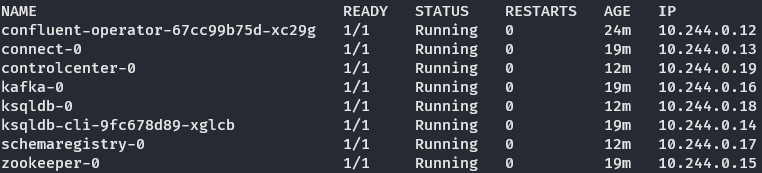

# Deploy the connector

1. Set port forwarding for the Kafka Connect pod:
    ```sh
    kubectl --kubeconfig=kubeconfig port-forward connect-0 8083:8083
    ```

2. Make `deploy-connector.sh` script executable. To do this, run
    ```sh
    chmod +x deploy-connector.sh
    ```

3. Run the script:
    ```sh
    ./deploy-connector.sh
    ```

    You should get the "`Connector configuration submitted.`" message if done correctly. In case of errors during the submission, the script will print the details. For example:
    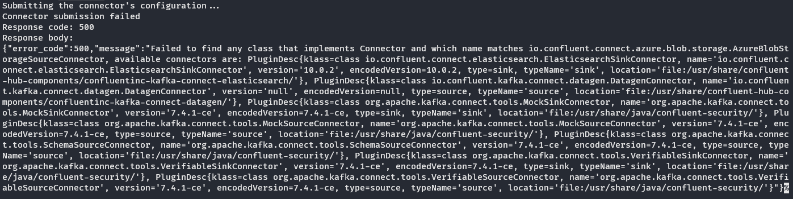

# Deploy the Kafka streams application

1. Make `deploy-streams-app.sh` script executable. To do this, run
    ```sh
    chmod +x deploy-streams-app.sh
    ```

2. Run the script:
    ```sh
    ./deploy-streams-app.sh
    ```

3. Check the deployment
    - Run 
      ```sh
      kubectl --kubeconfig=kubeconfig get pods -o wide | grep 'kstream-app'
      ```
    - Make sure the pod is up and its status is "Running":
      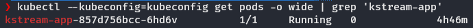

# Check the results

1. Set port forwarding for the Control Center pod
    ```sh
    kubectl --kubeconfig=kubeconfig port-forward controlcenter-0 9021:9021
    ```

2. Open the Control Center web console: http://localhost:9021

3. Navigate to "Topics" page:
    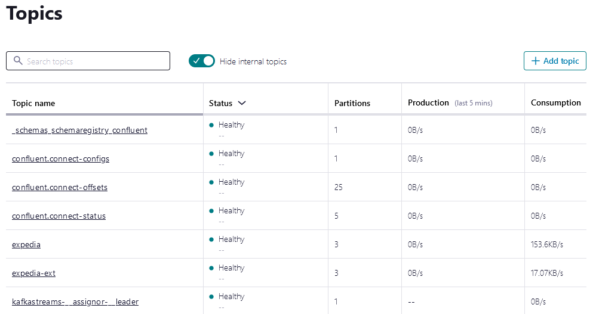

4. Open "expedia-ext" topic and go to "Messages" tab. Adjust timeframe of offset and inspect messages in the topic's partitions:
  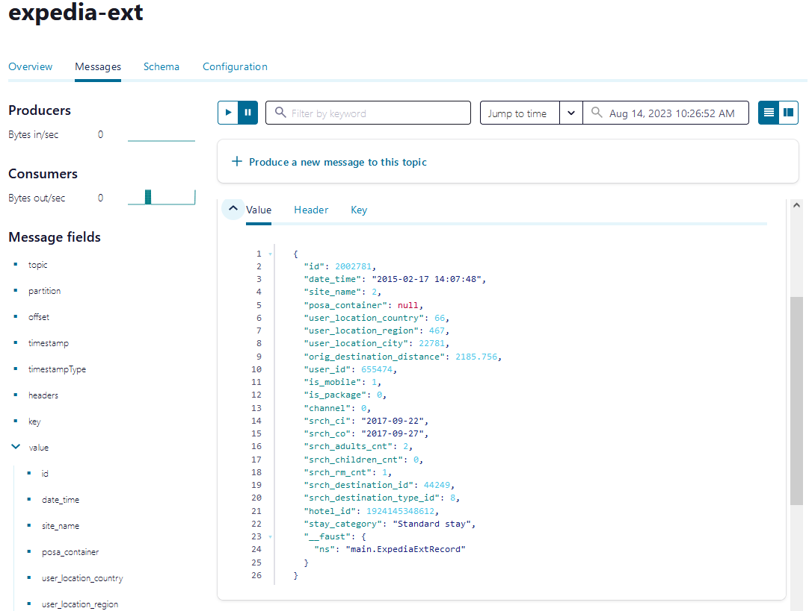

# Visualising the data

When there is enough data in `expedia-ext` topic, it's time to aggregate it using KSQL.

1. Open ksqldb CLI:
    ```
    kubectl --kubeconfig=kubeconfig exec --stdin --tty $(kubectl --kubeconfig=kubeconfig get pods -o name | grep 'ksqldb-cli') -- ksql http://ksqldb.confluent.svc.cluster.local:8088
    ```
    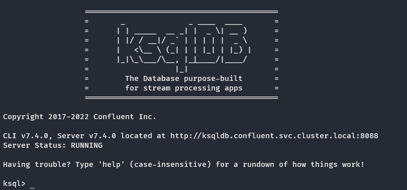

2. Set offset to pump data from the beginning of the topic:
    ```
    set 'auto.offset.reset'='earliest';
    ```
    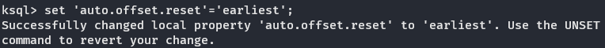

3. Create a stream backed by `expedia-ext` topic:
    ```
    create or replace stream hotelstream (
        id string,
        hotel_id bigint,
        stay_category string
    ) with (
        kafka_topic = 'expedia-ext', key_format = 'kafka', value_format = 'json', partitions = 3, replicas = 1
    );
    ```

4. Now create an aggregating table to count all hotels:
    ```
    create table all_hotels_count as
    select 1, count_distinct(hotel_id) as hotels_count
    from hotelstream
    group by 1;
    ```
    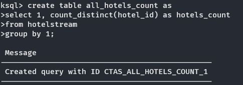

5. When the table is filled, you can query its contents:
    ```
    select hotels_count from all_hotels_count;
    ```
    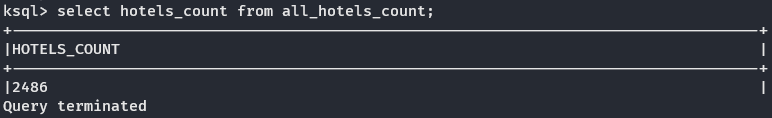

6. Then, let's aggregate hotels by the category of stay. Create a table:
    ```
    create table stays_hotels_count as 
    select stay_category, count_distinct(hotel_id) as hotels_count
    from hotelstream
    group by stay_category;
    ```
    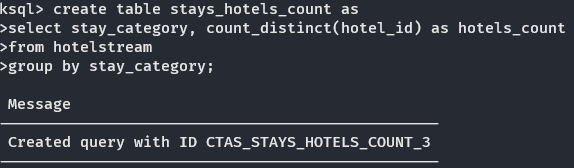

7. And, when this table is filled, query its contents:
    ```
    select * from stays_hotels_count;
    ```
    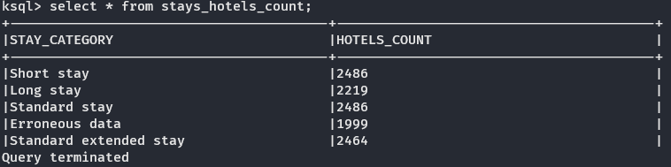